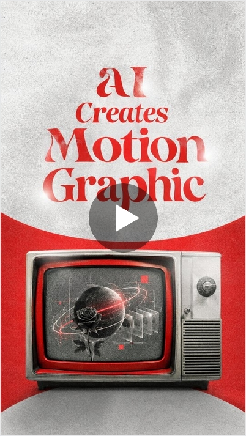
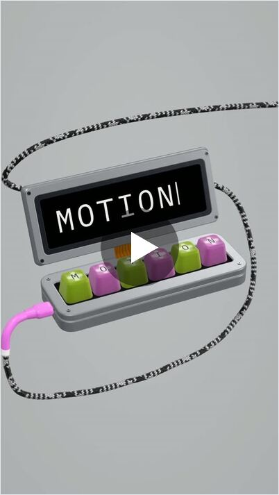
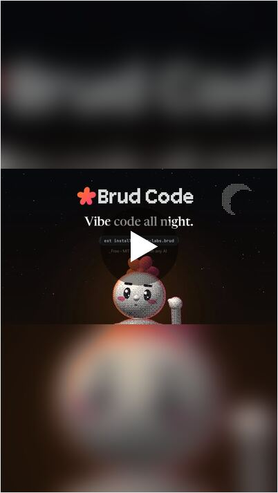
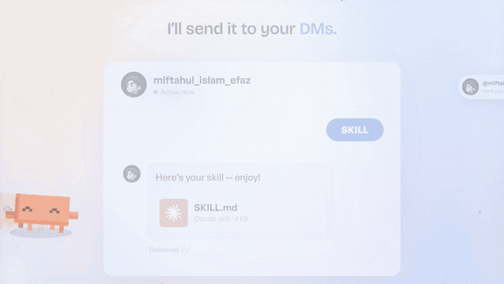

<div align="center">

# 🎬 Motion Video Director

### Turn your AI coding agent into a full motion-design studio *and* a pro video editor.

**One prompt → story, voiceover script, 2D/3D motion graphics, raw-footage edits, captions, sound design and a final render. Everything runs on your own machine.**

[](#-install-in-30-seconds)
[](#other-agents-codex-cursor-claude-desktop-vs-code)
[](#changelog)
[](https://www.instagram.com/miftahul_islam_efaz/)


<sub>☝️ Every frame above was drawn in code by an AI agent running this skill. No After Effects, no templates.</sub>

</div>

---

## ✨ What is this?

**Motion Video Director** is a skill/plugin that gives Claude Code (or any agent with terminal + file access) the brain of a **director, producer, motion designer, editor and sound designer**.

You bring the idea and references. The agent:

1. 🧠 **Directs:** turns your story into a hook → problem → solution → proof → CTA plan.
2. 🎙️ **Writes a paste-ready ElevenLabs voiceover script.** You generate the MP3 and send it back.
3. ✏️ **Storyboards** every shot with timings locked to the voice, word by word.
4. 🎨 **Animates in code:** Canvas, SVG, Three.js 3D, GSAP, p5.brush, Motion Canvas / Revideo.
5. ✂️ **Edits raw footage like a pro:** punch zooms, cutouts, text behind subject, captions, speed ramps, whips, color.
6. 🔊 **Sound-designs:** whooshes, risers, impacts and UI clicks synced to the frame, ducked under the VO, mastered to −14 LUFS.
7. 🖥️ **Renders** frame-perfect MP4s through headless Chrome + ffmpeg, checking every change with a fast preview loop first.

> It's not just a prompt. It's a full production pipeline: a 440-line director's playbook (`SKILL.md`) plus helper scripts for preflight, reference analysis, previews and API-key setup.

---

## 🎥 Made with this skill

Real outputs posted on Instagram. Tap a card to watch.

<div align="center">

| AI Creates Motion Graphic | MOTION keyboard | Brud Code launch |
|:---:|:---:|:---:|
| [](https://www.instagram.com/reel/DeImcItix7Z/) | [](https://www.instagram.com/reel/DeH5WTZgSmX/) | [](https://www.instagram.com/reel/Dd54bw2J5bc/) |
| [▶ Watch reel](https://www.instagram.com/reel/DeImcItix7Z/) | [▶ Watch reel](https://www.instagram.com/reel/DeH5WTZgSmX/) | [▶ Watch reel](https://www.instagram.com/reel/Dd54bw2J5bc/) |

</div>

**And the ad for this very skill**: a 56-second, 1080p, fully voiced and sound-designed launch film, built end to end by an agent running Motion Video Director:

<div align="center">

</div>

---

## 🚀 Install in 30 seconds

### Claude Code (recommended, as a plugin)

```text
/plugin marketplace add Miftahul-Islam-Efaz/Motion-graphics-skill
/plugin install motion-video-director@motion-graphics-skill
```

Restart Claude Code, then just say:

```text
Make me a 30-second 9:16 reel for my SaaS launch. Here are my references…
```

### Claude Code (manual skill install)

```bash
git clone https://github.com/Miftahul-Islam-Efaz/Motion-graphics-skill.git
# personal (all projects)
cp -r Motion-graphics-skill/skills/motion-video-director ~/.claude/skills/
# or project-only
cp -r Motion-graphics-skill/skills/motion-video-director .claude/skills/
```

### Other agents (Codex, Cursor, Claude Desktop, VS Code)

Copy `skills/motion-video-director/` into your project and tell the agent:

```text
Read skills/motion-video-director/SKILL.md and follow it as your operating manual for this video project.
```

Any agent that can run terminal commands and edit files can use it.

---

## 🧩 What's inside

```text
Motion-graphics-skill/
├── .claude-plugin/
│   ├── plugin.json          # Claude Code plugin manifest
│   └── marketplace.json     # one-command install
└── skills/motion-video-director/
    ├── SKILL.md             # the director's playbook (the brain)
    └── scripts/
        ├── preflight.sh     # checks node, ffmpeg, Playwright, Python models, API keys
        ├── preview.mjs      # fast preview loop: renders any time range to a contact sheet
        ├── analyze_ref.sh   # breaks a reference video into frames, cuts, spectrogram, audio
        ├── create_env.sh    # creates a safe .env with empty key slots
        └── normalize_env.py # turns messy key files into a clean .env (never prints values)
```

### The playbook covers

| Area | What the agent knows |
|---|---|
| 🎬 **Directing** | Hooks in the first 3 s, pacing, shot vocabulary, J/L cuts, match cuts, CTA rules |
| 🔥 **Editing intensity** | 5 levels, from hyper reels to restrained corporate. Effects must earn their place |
| ✏️ **Motion catalogue** | Kinetic type, 3D text, UI mockups, cursors, stickers, halftone, ink, particles, Lottie |
| ✂️ **Raw-footage editing** | Punch zooms, RVM/SAM2 matting, text-behind-subject, silhouette flashes, speed ramps |
| 🧊 **3D** | Three.js product orbits, floating cards, fly-throughs, extruded logos |
| 🎞️ **Animation principles** | Disney's 12, easing families, stagger, overshoot, eye-trace |
| 🎨 **Color & layout** | 60-30-10, WCAG contrast, 9:16 safe zones, type pairing |
| 🔊 **Sound design** | Riser → impact → whoosh, frame-accurate sync, sidechain ducking, −14 LUFS / −1.5 dBTP |
| 🎙️ **Voiceover** | ElevenLabs v3/v4 scripting, VO intake QA, word-level timestamps with faster-whisper |
| 🔎 **Asset hunting** | Firecrawl fonts, Freesound, Pexels/Pixabay, LottieFiles, plus Playwright to browse Pinterest/Behance/Dribbble by itself |
| ✅ **QA** | A delivery checklist so nothing ships with cropped text, pops or clipping |

---

## 🛠️ Requirements

| Required | Optional (unlocks more) |
|---|---|
| Node.js 18+ and npm | Python 3.10+ with `faster-whisper`, `rembg`, `demucs` |
| ffmpeg + ffprobe | Playwright MCP (visual asset hunting) |
| Playwright / headless Chrome | ElevenLabs, Firecrawl, Freesound, Pexels, Pixabay, LottieFiles MCPs or API keys |

Run the preflight any time and it tells you exactly what's missing:

```bash
bash skills/motion-video-director/scripts/preflight.sh
```

API keys live in a local `.env` (auto-gitignored). Values are never printed.

---

## 🔁 How a project flows


Gates that need your approval: **script → plan → preview → final render.** The agent never renders a full video without your OK, and it keeps a `PROGRESS.md` + `LOG.md` so any session can pick up where the last one stopped.

---

## 💡 Prompt ideas

- *"Edit my raw talking-head clip into a premium 9:16 reel with kinetic captions and punch zooms."*
- *"Make a 45 s SaaS explainer of our dashboard, clarity-first, with soft UI sound design."*
- *"Recreate the energy of this reference (attached), but for my brand colors."*
- *"Turn this blog post into a 20 s hook video with a 3D product orbit."*

---

## ❓ FAQ

**Do I need After Effects or Premiere?** No. Everything is code + ffmpeg, rendered locally.

**Does it cost anything to run?** Rendering is local and free. ElevenLabs and some stock APIs have their own plans. Free tiers work for most projects.

**Can it edit real footage, or only animate?** Both. It cuts, mattes, captions, grades and sound-designs raw clips, and mixes in code-drawn graphics.

**Vertical and horizontal?** Yes. 9:16, 16:9 and 1:1, re-laid natively per format (never just cropped).

---

## 📜 Changelog

- **v3.0.0**: plugin packaging, fast preview loop, Playwright asset hunting, Demucs stems, Firecrawl font sourcing, reverse-engineered reference recipes.

---

<div align="center">

### If this saved you hours, **⭐ star the repo** and share your render. Tag me, I repost the best ones.

**Built by [Miftahul Islam Efaz](https://www.instagram.com/miftahul_islam_efaz/)** · AI Systems Developer

<a href="https://www.instagram.com/miftahul_islam_efaz/"></a>

© 2026 Miftahul Islam Efaz. All rights reserved.

</div>
